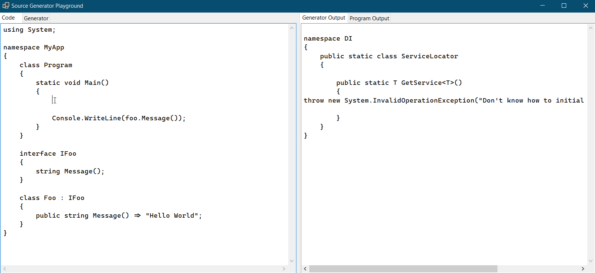

# Source Generator Playground

Source Generator PLayground is a simple Windows app that lets you experiment with a C# 9 source generator. It allows you to write a simple console application, and a source generator, and observe the generated output and the program output.

Multiple generators can be supplied, though they all need to live in the same text box, and the generator(s) can add any number of syntax trees to the compilation. All care is taken to capture meaningful errors from compilation of the generator, the program, and the running of the program.

Issues and PRs welcome, but please remember this is a work in progress. Yes the editor is not good, and yes this would be more useful as a website. I'll get there :)

### Note

This application compiles and runs code on your machine, and no responsibility is taken if any harm is done to your computer in doing so.
