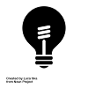
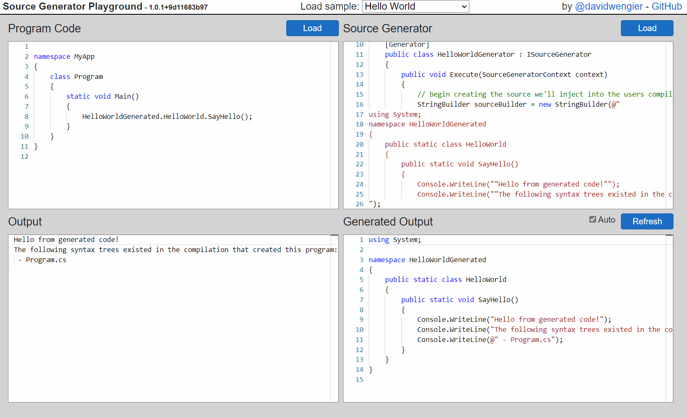

#  sourcegen.dev - The Source Generator Playground

Source Generator Playground is a simple Blazor app that lets you experiment with a C# 9 source generator. It allows you to write a simple console application, and a source generator, and observe the generated output and the program output.

Multiple generators can be supplied, though they all need to live in the same text box, and the generator(s) can add any number of syntax trees to the compilation. All care is taken to capture meaningful errors from compilation of the generator, the program, and the running of the program.

You can browse through the in built samples to try out generators, and start modifying things to see what happens. If you want to run your own, use the Load buttons. At the moment the only references available that can be leveraged is whatever is necessary for the app itself.

Feel free to log issues for feedback, or PRs for new samples etc.

